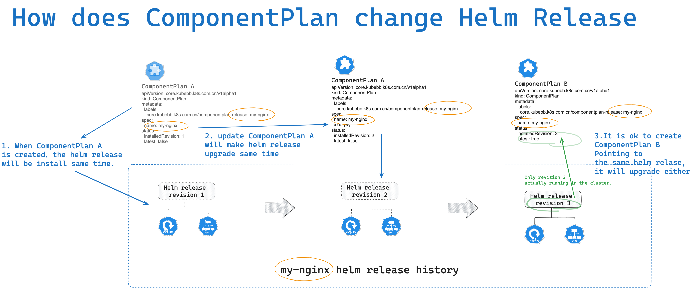

# 组件安装计划

ComponentPlan 会安装一个组件到集群，类似执行一次 `helm install/upgrade` 操作，只不过将 `helm install/upgrade` 命令中的参数固化到 ComponentPlan 的 spec
字段中，将涉及到的 docker 镜像以及安装后集群对象和现有对象的 diff 显示在 status字段中，并且可以设置失败后自动重试的次数。

## 使用

下面是一个 ComponentPlan 示例：

```yaml
apiVersion: core.kubebb.k8s.com.cn/v1alpha1
kind: ComponentPlan
metadata:
# labels:
#   core.kubebb.k8s.com.cn/componentplan-release: nginx
  name: nginx-15.0.2
  namespace: kubebb-system
spec:
  approved: true
  component:
    name: repository-bitnami-sample.nginx
    namespace: kubebb-system
  name: my-nginx
  override:
    images:
      - name: docker.io/bitnami/nginx
        newTag: latest # the default image is docker.io/bitnami/nginx:1.25.1-debian-11-r0, will be replaced by docker.io/bitnami/nginx:latest
  version: 15.0.2
#status:
#  conditions:
#    - lastTransitionTime: "2023-06-21T03:44:31Z"
#      reason: ""
#      status: "True"
#      type: Approved
#    - lastTransitionTime: "2023-06-21T03:44:37Z"
#      reason: ""
#      status: "True"
#      type: Installed
#    - lastTransitionTime: "2023-06-21T03:44:37Z"
#      reason: ""
#      status: "True"
#      type: Succeeded
#  images:
#    - docker.io/bitnami/nginx:latest
#  installedRevision: 3
#  latest: true
#  observedGeneration: 5
#  resources:
#    - NewCreated: true
#      apiVersion: v1
#      kind: Service
#      name: my-nginx
#    - NewCreated: true
#      apiVersion: apps/v1
#      kind: Deployment
#      name: my-nginx
```

上述 ComponentPlan 定义了安装的组件是 `kubebb-system` 命名空间的 `repository-bitnami-sample.nginx`。
安装名为 `my-nginx`，安装版本为 `15.0.2`。
同时在安装时，将镜像 `docker.io/bitnami/nginx` 的 `tag` 替换为 `latest`。

通过 `status` 字段可以看到，当前组件涉及的镜像以及资源。其中资源会标明是新创建还是更新现有资源，一个更新现有资源的例子为：

```yaml
- apiVersion: v1
  kind: Service
  name: my-wordpress
  specDiffwithExist: no spec diff, but some field like resourceVersion will update
- apiVersion: apps/v1
  kind: Deployment
  name: my-wordpress
  specDiffwithExist: |
    metadata:
      annotations: map[deployment.kubernetes.io/revision:2] -> <empty> (REMOVED)
    spec:
      replicas: 3 -> 1
      template:
        spec:
          containers:
            '[#0]':
              image: docker.io/bitnami/wordpress:6.2.2-debian-11-r9 -> docker.io/bitnami/wordpress:6.2.2-debian-11-r11
              resources:
                requests:
                  cpu: 400m -> 300m
                  memory: 1Gi -> 512Mi
```

## CRD 定义说明

CRD 的代码定义位于 [componentplan_types.go](https://github.com/kubebb/core/blob/main/api/v1alpha1/componentplan_types.go)。接下来会详细介绍每个字段的含义及其作用。

:::tip
说明：对于下面的 yaml，我们想要访问 bar 字段，书写格式为 `spec.foo.bar`

```yaml
spec:
  foo:
    bar: xx
```

:::

### 配置说明

ComponentPlan 的可选配置匹配了 helm install / upgrade / uninstall 的可选参数，有一些参数 ComponentPlan 并不支持:

1. `--create-namespace` 参数不支持，helm release 会创建在 ComponentPlan 的同名 namespace 中。
2. `--dry-run` 参数不支持，不需要模拟，模拟运行的结果会出现在 ComponentPlan 的 status 字段中。
3. `--replace` 参数不支持，helm 标记该参数不应该用于生产环境。
4. `--render-subchart-notes` 参数不支持，我们不展示 notes 信息。
5. `--devel` 参数不支持，如果需要使用`devel`版本，`spec.version` 字段指定 `>0.0.0-0` 即可。
6. `--nameTemplate` 和 `--generateName` 参数不支持，因为这两个字段在多次运行过程中可能会生成不确定的结果，我们使用 `spec.name` 来生成固定的名称。
7. `--reset-values` 和 `--reuse-values` 参数不支持，我们使用 `spec.override.values` 和 `spec.override.valuesFrom` 来重写配置。
8. 其他认证参数比如 `--username`，需要在 Repository 中指定。

其他配置为：

- `spec.componet`

  该字段用来指明要监控的组件实例，一般使用 `namespace` 和 `name` 来唯一确定
- `spec.version`

  需要安装的组件版本。
- `spec.approved`

  是否同意安装。`bool` 类型，`true` 或 `false`，当为 `true` 时，自动触发安装流程。为 `false` 时，只会解析这个组件的 `manifest`，并填充 `status` 字段，方便用户判断这次安装会对集群中现有资源带来的影响。
- `spec.name`

  组件安装到集群中的名称。类似 `helm release` 的名称
- `spec.force` *可选字段*

  布尔值，更新时通过替换策略强制更新资源, 类似 `helm upgrade --force` 参数，默认为 `false`
- `spec.timeoutSeconds` *可选字段*

  整数值，创建/更新/删除时的超时时间，单位为秒，默认为 `300`，即 5 分钟。类似 `helm install/upgrade --timeout` 参数
- `spec.wait` *可选字段*

  布尔值，如果设置为 `true`，将等待所有的 Pod、PVC、Service 和 Deployment、StatefulSet 或 ReplicaSet 的最小数量的 Pod 处于就绪状态才认为安装/更新成功。等待的时间即为 `spec.timeoutSeconds` 的值，默认为 `false`，类似 `helm install/upgrade --wait` 参数。
- `spec.waitForJobs` *可选字段*

  布尔值，如果设置为 `true`，将等待所有的 Job 完成才认为安装/更新成功。等待的时间即为 `spec.timeoutSeconds` 的值，默认为 `false`，类似 `helm install/upgrade --wait-for-jobs` 参数。
- `spec.description` *可选字段*

  给安装/更新添加一个自定义描述。默认为空，类似 `helm install/upgrade --description` 参数。
- `spec.dependencyUpdate` *可选字段*

  布尔值，在安装/更新组件前，是否更新缺少的依赖项。类似 `helm install/upgrade --dependency-update` 参数，默认为 `false`
- `spec.disableHooks` *可选字段*

  布尔值，如果设置为 `true`，则阻止 Hook 在安装过程中运行，并禁用升级前/后 Hook，类似 `helm install/upgrade --no-hooks` 参数，默认为 `false`
- `spec.disableOpenAPIValidation` *可选字段*

  布尔值，如果设置为 `true`，安装过程将不会根据 Kubernetes OpenAPI Schema 验证渲染的模板。类似 `helm install/upgrade --disable-openapi-validation` 参数，默认为 `false`
- `spec.atomic` *可选字段*

  布尔值，如果设置为 `true`，安装/更新过程会在安装/更新失败时删除安装。如果 `spec.atomic` 设置为 `true`，将自动设置 `spec.wait` 为 `true`。类似 `helm install/upgrade --atomic` 参数，默认为 `false`
- `spec.skipCRDs` *可选字段*

  布尔值，如果设置为 `true`，则跳过 CRD 的安装。默认情况下，如果尚未安装 CRD，会自动安装。类似 `helm install/upgrade --skip-crds` 参数，默认为 `false`
- `spec.enableDNS` *可选字段*

  布尔值，在渲染模板时是否启用 DNS 查询，类似 `helm install/upgrade --enable-dns` 参数 默认为 `false`
- `spec.historyMax` *可选字段*

  整数值，限制每个 release 保存的最大 revisions 数目。使用 `0` 表示无限制，默认为 `10`
- `spec.maxRetry` *可选字段*

  整数值，创建/更新最大重试次数，默认为 `5`
- `spec.cleanupOnFail` *可选字段*

  布尔值，当升级失败时，允许删除在此升级中创建的新资源，类似 `helm upgrade --cleanup-on-fail` 参数，默认为 `false`。
- `spec.keepHistory` *可选字段*

  布尔值，卸载时，删除所有相关资源，并将发布标记为已删除，但保留发布历史。类似 `helm uninstall --keep-history` 参数，默认为 `false`。
- `spec.override` *可选字段*

  用于覆盖原组件配置的字段。

  - `spec.override.values`

    `JSON` 格式的 `values`，用于覆盖默认值
  - `spec.override.valuesFrom`

    字段为数组。当要设定的字段偏多时，我们一般希望把 `values.yaml` 单独拿出来，放在 `ConfigMap` 或者 `Secret` 中，而且我们可能会有很多 `values.yaml` 文件。具体格式为：

    - `spec.override.valuesFrom[].kind`

      可选项为 `Secret` 或 `ConfigMap`
    - `spec.override.valuesFrom[].name`

      `Secret` 或 `ConfigMap` 的名称，不需要 `namespace` 字段，因为只会查找和当前 ComponentPlan 同 `namespace` 的资源。
    - `spec.override.valuesFrom[].valuesKey`

      `Secret` 或 `ConfigMap` 的 `data` 中的 `key`，默认为 `values.yaml` 会尝试先后查询 `ConfigMap` 中的 `Data` 和 `BinaryData` 字段，`Secret` 中的 `StringData` 和 `Data` 字段。
  - `spec.override.set`

    数组，类似 `helm template --set` 的参数
  - `spec.override.set-string`

    数组，类似 `helm template --set-string` 的参数
  - `spec.override.images`

    数组。类似 [`kustomize` 的镜像自定义参数](https://kubectl.docs.kubernetes.io/references/kustomize/builtins/#_imagetagtransformer_)

    - `spec.override.images[].name`

      去除 `tag` 后的原始镜像名称
    - `spec.override.images[].newName`

      替代原始镜像名称的名称
    - `spec.override.images[].newTag`

      替代原始 `tag` 的新 `tag` 名称
    - `spec.override.images[].digest`

      替代原始 `tag` 的新 `digest`，如果 `digest` 有值，会忽略 `newTag` 的值。

### 状态描述

一个典型的 ComponentPlan 状态示例如下：

```yaml
status:
  conditions:
    - lastTransitionTime: "2023-07-25T12:22:12Z"
      reason: ""
      status: "True"
      type: Approved
    - lastTransitionTime: "2023-07-25T12:25:00Z"
      message: timed out waiting for the condition
      reason: UpgradeFailed
      status: "False"
      type: Actioned
    - lastTransitionTime: "2023-07-25T12:25:00Z"
      reason: ""
      status: "False"
      type: Succeeded
  images:
    - docker.io/bitnami/nginx:xxxxx
  installedRevision: 4
  latest: true
  observedGeneration: 1
  resources:
    - NewCreated: true
      apiVersion: v1
      kind: Service
      name: my-nginx
    - NewCreated: true
      apiVersion: apps/v1
      kind: Deployment
      name: my-nginx
```

- `status.conditions`

  数组，ComponentPlan 的状态
  - `status.conditions[].lastTransitionTime`

    上次从一种状态转换到另一种状态时的时间戳
  - `status.conditions[].reason`

    机器可读的、驼峰编码（UpperCamelCase）的文字，表述上次状况变化的原因
  - `status.conditions[].message`

    人类可读的消息，给出上次状态转换的详细信息
  - `status.conditions[].status`

    表明该状况是否适用，可能的取值有 `True"`、`False` 或 `Unknown`
  - `status.conditions[].type`

      状况的名称

      可能包含以下状态：

    - `Approved`

      用户已经同意该组件安装计划（ComponentPlan）的安装
    - `Actioned`

      某个操作已经完成
    - `Succeeded`

      用户期待的操作已经全部完成

- `status.images`

  该 ComponentPlan 会引入的镜像列表
- `status.installedRevision`

  该 ComponentPlan 安装的helm release revision版本。
- `status.latest`

  helm release 的最新版本是否是该 ComponentPlan 安装的。支持多个 ComponentPlan 按部署时间安装/升级同一个 helm release。
- `status.observedGeneration`

  用于程序内部处理。表示该 ComponentPlan 基于的 `.metadata.generation` 的过期次数。 例如，如果 `.metadata.generation` 当前为 12，但 `.status.observedGeneration` 为 9， 则相对于实例的当前状态已过期。
- `status.resources`

  数组，ComponentPlan 涉及的资源

  - `status.resources[].specDiffwithExist`

    展示该资源的 manifest 在该 ComponentPlan 应用前后的对比
  - `status.resources[].NewCreated`

    布尔值，该资源是否是新创建的
  - `status.resources[].kind`

    该资源的类型
  - `status.resources[].name`

    该资源的名称
  - `status.resources[].apiVersion`

    该资源的 apiVersion 信息

## 工作原理

组件安装以 Kubernetes Operator 方式实现, 底层通过调用 Helm Go SDK 实现组件安装、升级和卸载。

在运行时，通过监测集群中是否有同名 `helm release` 来智能使用 `helm install` 或者 `helm upgrade` 相关函数进行安装或升级。

安装或升级时，会将 ComponentPlan 中的配置传递给相关函数，功能和 `helm install` 或者 `helm upgrade` 基本一致。

当删除 ComponentPlan 时，判断当前集群中的同名的 `helm release` 的最新版本是否由待删除的 ComponentPlan 安装，如果是，则同时调用 `helm uninstall` 相关函数删除该 helm release。

一些细节：

1. 创建 ComponentPlan 后，operator 会尝试自动解析该 ComponentPlan 中引入的 helm release 会对集群中现有资源的影响，结果会展示在 ComponentPlan 的 status
   字段中，类似于先进行 `helm install/upgrade --dry-run` 后，将生成的 manifest 再进行 `kubectl diff` 操作，
2. 只有 ComponentPlan 中的 `spec.approved` 为 `true`，对应的 `helm release` 才会真正安装。
3. 单个 ComponentPlan 的镜像替换 （即 `spec.override.images`
   字段）的规则遵循 [kustomize:ImageTagTransformer](https://kubectl.docs.kubernetes.io/references/kustomize/builtins/#_imagetagtransformer_)
   规范，代码实现也是直接调用了 kustomize 的这部分代码，降低了用户学习成本，保证了代码的兼容性和有效性。
4. 单个 ComponentPlan 的镜像替换和整个 Repository 的镜像替换，都是通过 [Helm:post-rendering](https://helm.sh/docs/topics/advanced/#post-rendering)
   技术实现的。

### 镜像覆盖策略


### ComponentPlan 和 Helm release 的关系


