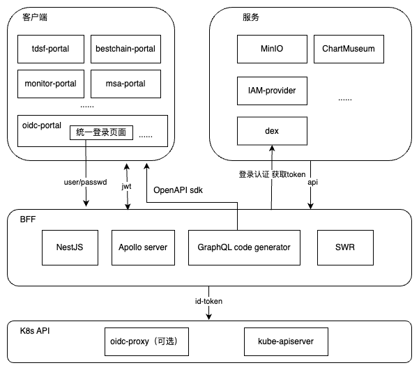
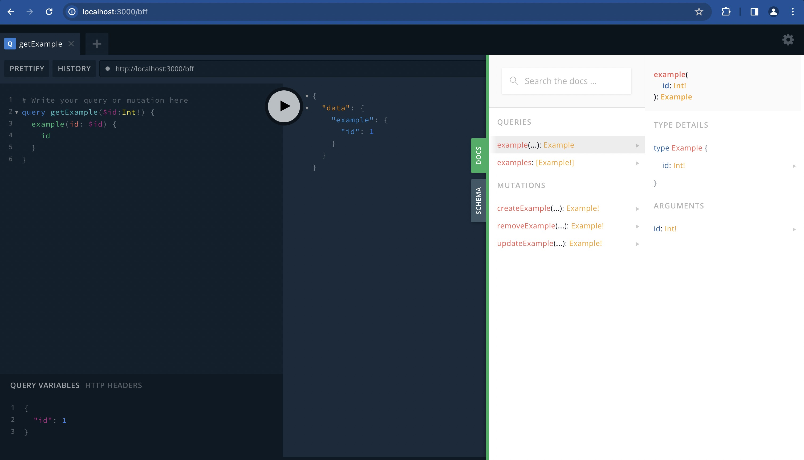

# BFF 层 API 开发

本章节对 Kubebb 的 BFF 层进行详细介绍，包括如何使用 GraphQL 快速开发 BFF 层的 API

### 架构概述



BFF 层是采用 [NestJS](https://docs.nestjs.com/) 和 [GraphQL](https://graphql.cn/)构建的一个独立的[NodeJs](https://nodejs.org/en/about)服务，主要功能为聚合K8S API后，对外提供一系列OpenAPI，满足前端需要的、无冗余、可预测的数据。

### 如何工作的

其通过 NestJS 搭建了一个NodeJs服务，以插件的形式接入 [Apollo Server](https://www.apollographql.com/docs/apollo-server/) 作为 GraphQL server，提供客户端使用的 GraphQL API。BFF作为承接前后端的桥梁，通过统一登录页面，从后端获取id-token，用此token连接 [K8s](https://kubernetes.io/) APIServer，从而操作K8s资源（CRUD）；另外也可扩展接入其他服务（如[MinIO](https://minio.org.cn/)、[ChartMuseum](https://chartmuseum.com/)等）。


### 快速开始

1. 新建 NestJS 项目（TypeScript & GraphQL）

    ```shell
    npm i -g @nestjs/cli

    nest new hello-world --strict

    pnpm add @nestjs/graphql @nestjs/apollo @apollo/server graphql
    ```

2. 接入 Grahpql

    ```
    <!-- src/app.module.ts -->
    ...
    @Module({
      imports: [
        GraphQLModule.forRoot<ApolloDriverConfig>({
          path: '/bff',
          introspection: true,
          driver: ApolloDriver,
          autoSchemaFile: join(process.cwd(), 'src/schema.gql'),
          sortSchema: true,
          playground: {
            settings: {
              'request.credentials': 'same-origin',
              'tracing.hideTracingResponse': true,
              'queryPlan.hideQueryPlanResponse': true,
              'schema.polling.interval': 1000 * 60,
            },
          },
          subscriptions: {
            'graphql-ws': {
              path: '/bff',
            },
          },
        }),
        ExampleModule,
      ],
      controllers: [AppController],
      providers: [AppService],
    })
    ...
    ```

3. 开发一个新的GraphQL (code first)功能模块

    ```shell
    nest g res example
    ```

    略微修改后运行服务：http://localhost:3000/bff

    


4. 生成SDK

    > 使用 [graphql-codegen-plugin-typescript-swr](https://the-guild.dev/blog/graphql-codegen-plugin-typescript-swr) 生成可供React Hook直接调用API的SDK。此工具整合了[GraphQL Code Generator](https://the-guild.dev/graphql/codegen) (将 GraphQL schema 自动生成 GraphQL operations（Typed Queries, Mutations and, Subscriptions）)和 [SWR](https://swr.vercel.app/)。

    * 安装依赖

      ```shell
      pnpm add -D @graphql-codegen/cli @graphql-codegen/typescript @graphql-codegen/typescript-operations @graphql-codegen/typescript-graphql-request graphql-codegen-plugin-typescript-swr
      ```

    * 编写配置文件`codegen.yml`

      ```
      <!-- codegen.yml -->
      overwrite: true
      generates:
        static/client-sdk/sdk.ts:
          schema: 'http://localhost:3000/bff'
          documents: 'src/**/*.gql'
          plugins:
            - typescript
            - typescript-operations
            - typescript-graphql-request
            - plugin-typescript-swr
      config:
        autogenSWRKey: true
      ```

    * 编写`.gql`，定义前端可直接调用

      ```
      // src/example/example.gql
      # 获取样例详情
      query getExample($id:Int!) {
        example(id: $id) {
          id
        }
      }
      ```

    * 执行

      ```shell
      npx graphql-codegen
      ```

### 推荐工具

  * [generate-nest-module](https://github.com/dayuy/ast-auto-generate)

    > 可快速生成一个K8s 资源的 CRUD 模块代码。已被应用在[component-store](https://github.com/kubebb/component-store/tree/main/packages/bff-server/src/subscription)的开发中。

    ```shell
    # 安装
    npm install -g generate-nest-module

    # 使用
    gennest g res subscription
    ```
